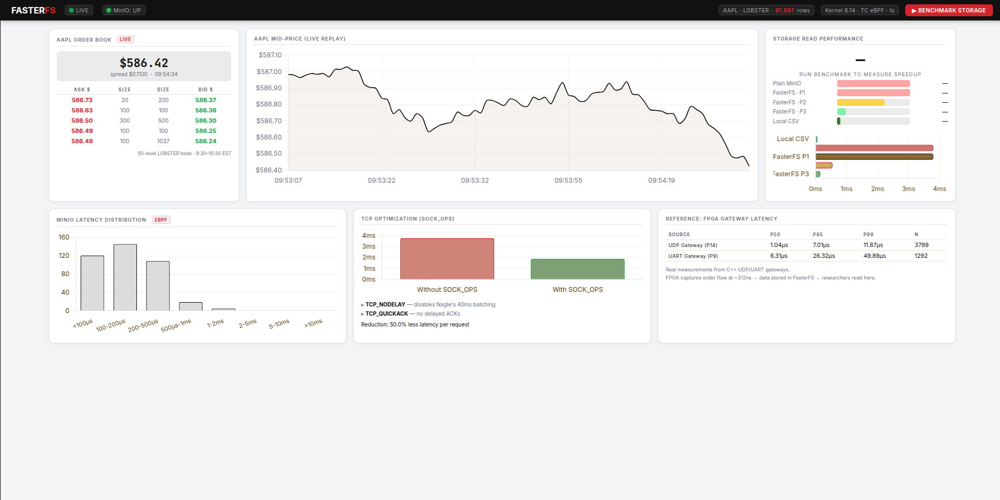
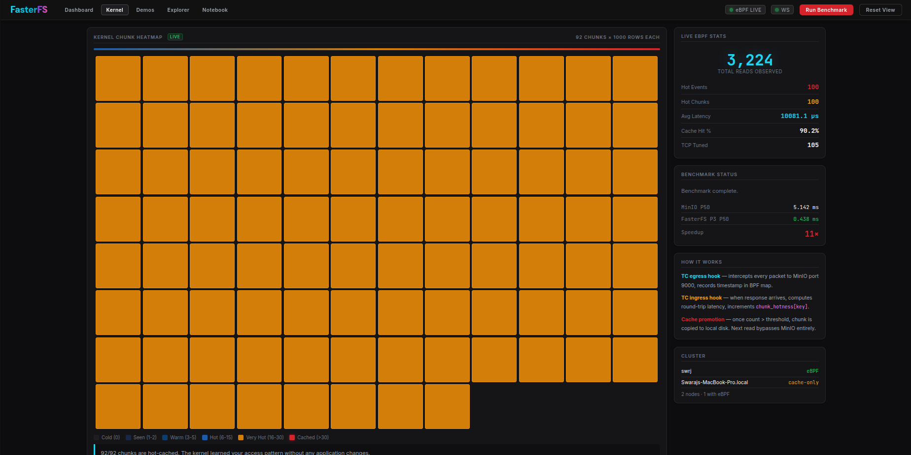
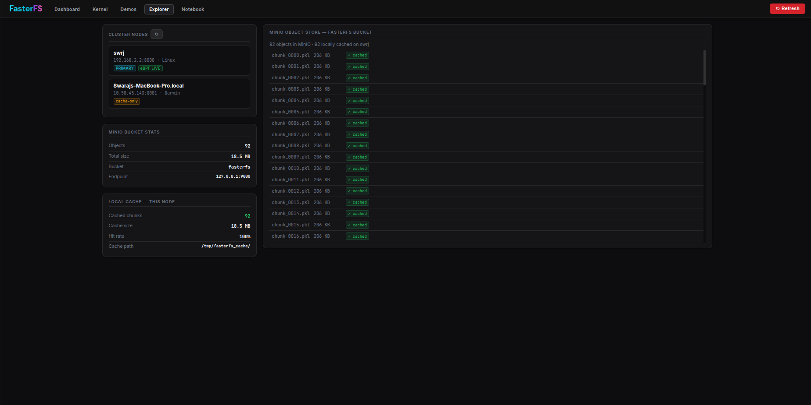
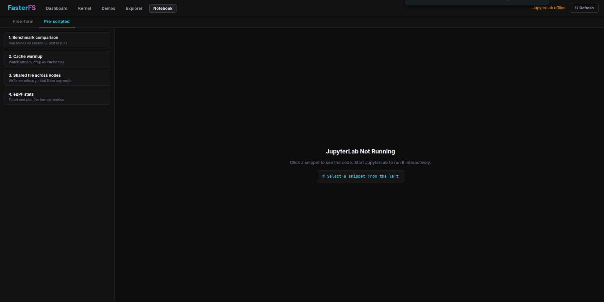

# FasterFS

A distributed storage system that uses Linux eBPF programs to automatically cache hot data locally, and pools read bandwidth across nodes so that adding a machine measurably increases throughput.

---

## How It Works

### Single Node

```
  Your App (Python / any HTTP client)
         │
         ▼
  ┌─────────────────────────────────────┐
  │         FasterFS Server :8000        │
  │                                     │
  │  read_chunk(idx)                    │
  │    ├─ cache hit?  ──► local disk    │  ~0.4 ms
  │    └─ cache miss? ──► MinIO :9000   │  ~3.5 ms
  └──────────────┬──────────────────────┘
                 │ loopback TCP
                 ▼
         ┌───────────────┐
         │  MinIO :9000  │  (object store, holds chunk files)
         └───────────────┘
                 │
         ┌───────┴───────────────────────────────────┐
         │          Linux Kernel (TC eBPF)            │
         │                                           │
         │  Every packet to/from MinIO :9000          │
         │  → record timestamp (egress)               │
         │  → compute latency, increment hotness      │
         │    counter (ingress)                       │
         │  → if count > threshold: emit HOT event   │
         │  → FasterFS writes chunk to local disk    │
         └───────────────────────────────────────────┘
```

### eBPF Pipeline

```
  [App sends GET /chunk_0042]
         │
         ▼  egress TC hook fires
  ┌─────────────────────────┐
  │  record timestamp        │  → flow_timestamps BPF map
  │  keyed by TCP port       │
  └─────────────────────────┘
         │
         ▼  (MinIO processes request)
         │
         ▼  ingress TC hook fires
  ┌─────────────────────────┐
  │  lookup timestamp        │  ← flow_timestamps BPF map
  │  compute latency (ns)    │
  │  increment chunk counter │  → chunk_hotness BPF map
  │  update global stats     │  → global_stats BPF map
  │  if hot: emit event      │  → ring buffer → FasterFS
  └─────────────────────────┘
         │
         ▼
  FasterFS reads HOT event → writes chunk to /tmp/fasterfs_cache/
  Next read: served from disk in ~0.4ms instead of ~3.5ms over loopback
```

A second eBPF program at the SOCK_OPS hook sets `TCP_NODELAY` and `TCP_QUICKACK` on every new MinIO connection automatically.

### Cluster (2+ Nodes)

```
  ┌────────────────────────────────────────────────────────────┐
  │                    Linux Node (Primary)                     │
  │   MinIO :9000  chunks 0–45    FasterFS :8000               │
  │   eBPF TC hook (live)         cluster coordinator          │
  └──────────────────────────┬─────────────────────────────────┘
                              │  WiFi / Ethernet
                              │  heartbeat + benchmark RPC
                              │
  ┌───────────────────────────┴────────────────────────────────┐
  │                    Mac / Linux Client Node                  │
  │   MinIO :9000  chunks 46–91   FasterFS :8001               │
  │   local disk cache            registers with primary        │
  └────────────────────────────────────────────────────────────┘

  Demo B — same 600 MB dataset:
    1 node:  17 s  │  35 MB/s
    2 nodes:  8.7 s │  69 MB/s  ← 1.95× speedup (each node reads its own partition)
```

Each node holds a partition of the dataset in its own local MinIO. During a benchmark, all nodes read their partition simultaneously. Adding a node adds its full local disk bandwidth to the aggregate.

---

## Requirements

**Primary node (Linux, for eBPF):**
- Linux kernel 5.8+ (for BPF ring buffers)
- `clang`, `bpftool`, `libbpf-dev`
- Python 3.10+
- Root access (for eBPF program loading)

**Client nodes (Linux or macOS):**
- Python 3.10+
- MinIO binary
- No root required (eBPF disabled, local disk caching still works)

---

## Setup — Primary Node (Linux)

### 1. Install dependencies

```bash
# System
sudo apt install clang llvm libbpf-dev linux-tools-$(uname -r)

# Python
pip install fastapi uvicorn boto3 pandas numpy httpx websockets pyarrow
```

### 2. Start MinIO

```bash
# Download MinIO binary if not present
wget https://dl.min.io/server/minio/release/linux-amd64/minio
chmod +x minio

# Start (data persists in /tmp/fasterfs-minio-data)
MINIO_ROOT_USER=admin MINIO_ROOT_PASSWORD=adminpass123 \
  ./minio server /tmp/fasterfs-minio-data \
  --address :9000 --console-address :9001 &
```

### 3. Upload LOBSTER data

Place the LOBSTER AAPL dataset in `LOBSTER_SampleFile_AAPL_2012-06-21_50/` at the repo root, then:

```bash
cd final_implementation
python3 -c "from storage_backends import upload_chunks; upload_chunks(print)"
```

### 4. Start FasterFS

```bash
# Must run as root to load eBPF programs
cd final_implementation
sudo PYTHONPATH=$(pip3 show fastapi | grep Location | awk '{print $2}') \
  python3 main.py
```

Dashboard available at `http://localhost:8000`

To verify eBPF is live (not simulating):
```bash
curl -s http://localhost:8000/api/ebpf/stats | python3 -m json.tool
# Look for: "simulation": false
```

---

## Setup — Client Node (joining the cluster)

Any laptop (Linux or macOS) can join as a client node.

### 1. Clone and install

```bash
git clone <repo-url>
cd FasterFS
pip install fastapi uvicorn boto3 pandas numpy httpx websockets pyarrow
```

### 2. Start local MinIO

```bash
# macOS
curl -O https://dl.min.io/server/minio/release/darwin-arm64/minio
chmod +x minio

MINIO_ROOT_USER=admin MINIO_ROOT_PASSWORD=adminpass123 \
  ./minio server /tmp/fasterfs-minio-data \
  --address :9000 --console-address :9001 &
```

### 3. Start FasterFS pointing at the primary

```bash
cd final_implementation
PRIMARY_URL=http://<primary-ip>:8000 \
  MINIO_ENDPOINT=http://127.0.0.1:9000 \
  python3 main.py
```

Replace `<primary-ip>` with the Linux primary node's IP address.

The node will:
- Register itself with the primary automatically
- Appear in the cluster dashboard at `http://<primary-ip>:8000`

### 4. Sync your chunk partition

Once registered, the primary can push your chunk partition to your local MinIO:

```bash
# Run this on the primary, or via the dashboard
curl -s -X POST http://<your-ip>:<your-port>/api/node/sync_chunks \
  -H "Content-Type: application/json" \
  -d '{"source_endpoint": "http://<primary-ip>:9000", "start_chunk": 46, "end_chunk": 92}'
```

The exact chunk range depends on how many nodes are in the cluster. The primary assigns ranges automatically during benchmarks.

---

## Environment Variables

| Variable | Default | Description |
|----------|---------|-------------|
| `MINIO_ENDPOINT` | `http://127.0.0.1:9000` | MinIO endpoint this node reads from |
| `PRIMARY_URL` | _(empty)_ | Set on client nodes to point at the primary. Empty = this node is primary |
| `NODE_ID` | hostname | Unique identifier for this node |
| `PORT` | `8000` | Port FasterFS listens on |
| `MINIO_ACCESS` | `admin` | MinIO access key |
| `MINIO_SECRET` | `adminpass123` | MinIO secret key |

---

## API Reference

```
GET  /                          Dashboard
GET  /kernel                    Live eBPF heatmap
GET  /demos                     Demo A / B / C

GET  /api/cluster               All registered nodes + global eBPF stats
GET  /api/ebpf/stats            Live kernel metrics (reads, latency, hot chunks)

POST /api/benchmark/run         Run Demo A (caching speedup, 5-pass)
GET  /api/benchmark/result      Poll Demo A result

POST /api/benchmark/distributed Run Demo B (node scaling, ?node_count=N)
GET  /api/benchmark/distributed/result

POST /api/sort/run              Run Demo C (distributed sort)
GET  /api/sort/result

POST /api/node/sync_chunks      Sync chunk range from another MinIO
```

---

## Project Structure

```
FasterFS/
├── final_implementation/
│   ├── ebpf/
│   │   ├── fasterfs_monitor.bpf.c   # TC hook: latency + hotness tracking
│   │   ├── fasterfs_sockopts.bpf.c  # SOCK_OPS: TCP_NODELAY + TCP_QUICKACK
│   │   └── loader.py                # Compile, attach, read BPF maps
│   ├── static/
│   │   ├── index.html               # Main dashboard
│   │   ├── kernel.html              # Live eBPF chunk heatmap
│   │   ├── demos.html               # Demo A / B / C
│   │   └── fs.html                  # Filesystem explorer
│   ├── storage_backends.py          # LocalCSV / MinIO / FasterFS backends
│   ├── benchmark.py                 # Demo A + Demo B benchmark logic
│   ├── ebpf_cache.py                # eBPF stats reader
│   └── main.py                      # FastAPI server
└── LOBSTER_SampleFile_AAPL_.../     # Market data (not in repo)
```

---

## Verified Numbers (2-node setup, Linux + MacBook)

| Demo | Result |
|------|--------|
| Caching speedup (loopback) | MinIO 3.5 ms → FasterFS 0.4 ms = **8.3×** |
| Caching speedup (WiFi) | MinIO 57.8 ms → FasterFS 0.2 ms = **333×** |
| 1-node throughput | 17 s, 35 MB/s for 600 MB dataset |
| 2-node throughput | 8.7 s, 69 MB/s for 600 MB dataset = **1.95×** |

---

## Screenshots

### Dashboard


### Live eBPF Kernel Heatmap (`/kernel`)


### Demos — Caching & Node Scaling Benchmarks (`/demos`)


### Filesystem Explorer (`/fs`)


### Interactive Notebook (`/notebook`)

